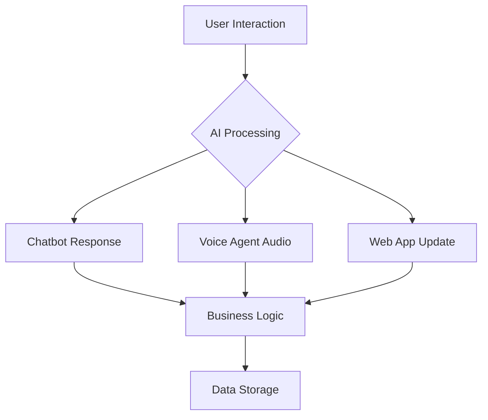

## Welcome to Vaibrix

Vaibrix is a cutting-edge technology company that empowers businesses to revolutionize their operations through innovative AI solutions. They specialize in crafting custom chatbots, voice agents, and web development services designed to streamline processes, enhance customer engagement, and drive growth.

<Columns cols={3}>
  <Card title="Chatbots" icon="message-square" href="chatbots">
    Build intelligent conversational AI to handle customer inquiries and automate support.
  </Card>
  <Card title="Voice Agents" icon="mic" href="voice-agents">
    Create voice-powered assistants for seamless audio interactions and voice commands.
  </Card>
  <Card title="Web Development" icon="code" href="web-development">
    Develop custom web applications with modern technologies and responsive design.
  </Card>
</Columns>

<Tabs>
  <Tab title="Getting Started" icon="play">
    To begin using Vaibrix services, first create an account on our platform. This gives you access to our dashboard where you can configure and deploy your AI solutions. Our team provides comprehensive onboarding support to ensure a smooth integration into your business workflow.

    <Callout kind="info">For enterprise clients, we offer dedicated account managers to guide you through the implementation process.</Callout>

    <Steps>
      <Step title="Sign Up" icon="user-plus">
        Create your account at vaibrix.com/signup and verify your email.
      </Step>
      <Step title="Choose Service" icon="settings">
        Select from our chatbots, voice agents, or web development offerings.
      </Step>
      <Step title="Configure" icon="sliders">
        Customize your solution using our intuitive dashboard interface.
      </Step>
      <Step title="Deploy" icon="rocket">
        Launch your AI-powered solution into production.
      </Step>
    </Steps>
  </Tab>
  <Tab title="Features" icon="star">
    <ExpandableGroup>
      <Expandable title="AI-Powered Intelligence" default-open="true">
        Our solutions leverage advanced machine learning algorithms to understand context, maintain conversation flow, and provide accurate responses. This ensures your customers receive helpful, human-like interactions.
      </Expandable>
      <Expandable title="Scalable Architecture" default-open="false">
        Built on cloud-native infrastructure, our services automatically scale to handle peak loads while maintaining performance. This means your solutions grow with your business needs.
      </Expandable>
      <Expandable title="Easy Integration" default-open="false">
        Seamlessly integrate with existing systems through REST APIs, webhooks, and SDKs. Our documentation provides clear examples for popular platforms like Salesforce, Zendesk, and custom CRM systems.
      </Expandable>
    </ExpandableGroup>
  </Tab>
</Tabs>

<Callout kind="tip">Explore our API reference for technical integration details and code examples.</Callout>

